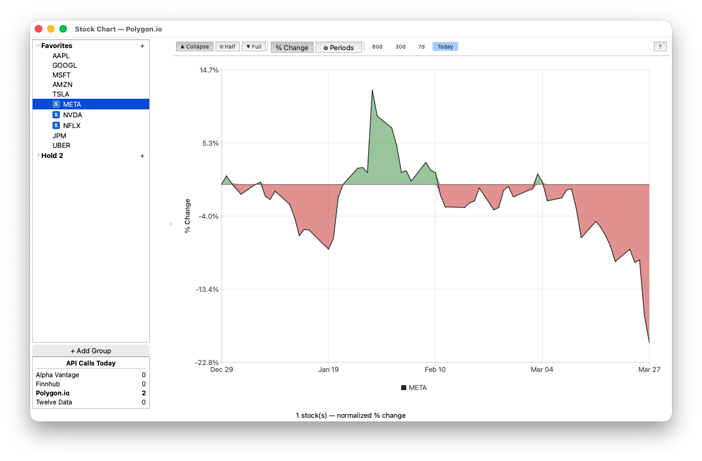
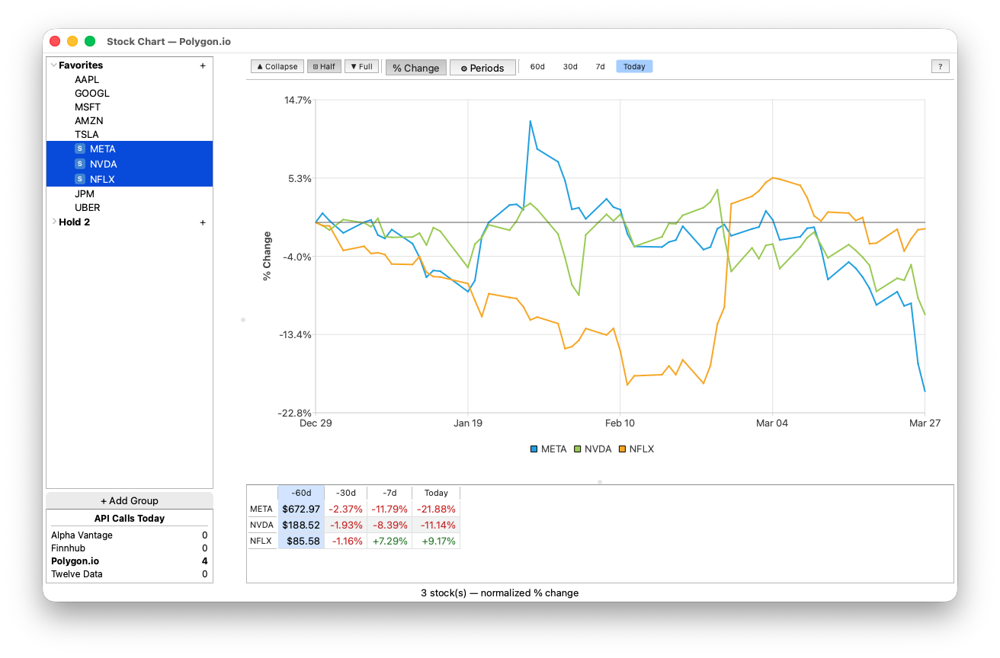

# qt-stockchart

A Qt/C++ desktop application for viewing and comparing stock price history as interactive line charts. Supports multiple data providers, grouped watchlists, split-screen comparisons, and a configurable data table with calculated metrics.

## Screenshots





## Features

- **Interactive line charts** — crosshair cursor, zero-line overlay, configurable date range (7d / 30d / 60d / all)
- **Split-screen mode** — view multiple stocks side-by-side for quick comparison
- **Grouped watchlists** — organize symbols into custom groups; export/import groups to file
- **Data table** — collapsible panel (collapsed / half / full) showing price data with switchable absolute/percent-change display and configurable calculation periods
- **Symbol type detection** — automatically identifies Stocks, ETFs, Indexes, Mutual Funds, and Crypto
- **API call tracking** — per-provider daily call counter with persistence
- **Multiple data providers** — switch between providers from the Settings dialog

## Data Providers

| Provider | Free Tier | Notes |
|---|---|---|
| [Alpha Vantage](https://www.alphavantage.co) | Yes | Requires API key |
| [Finnhub](https://finnhub.io) | Yes | Requires API token |
| [Polygon.io](https://polygon.io) | Yes (limited) | Requires API key |
| [Twelve Data](https://twelvedata.com) | Yes | Requires API key |

Each provider implements a common `StockDataProvider` interface. Select and configure your preferred provider (including API credentials) via **File → Settings**.

## Requirements

- Qt 6 (Widgets, Charts, Network modules)
- CMake 3.16+
- C++17 compiler

On macOS, install Qt via Homebrew:

```bash
brew install qt
```

## Building

```bash
mkdir build && cd build
cmake .. -DCMAKE_PREFIX_PATH=/opt/homebrew/opt/qt
make -j$(sysctl -n hw.logicalcpu)
./StockChart
```

## License

Licensed under the [Apache License 2.0](LICENSE).
